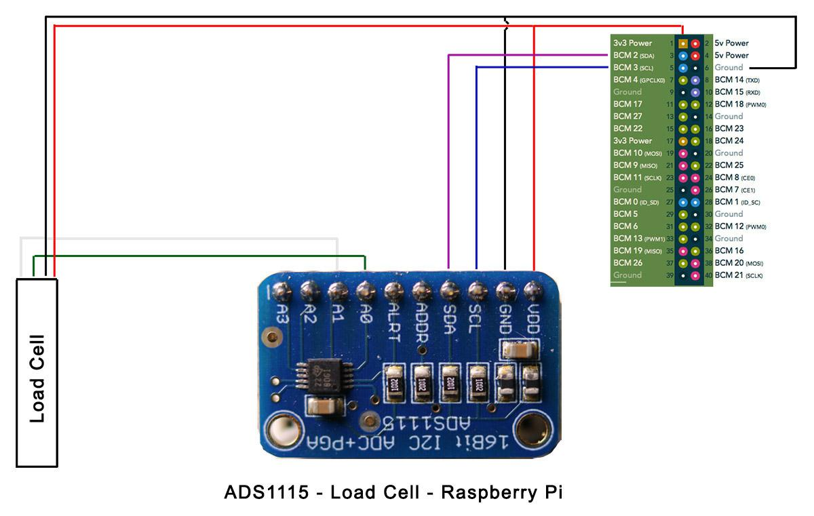
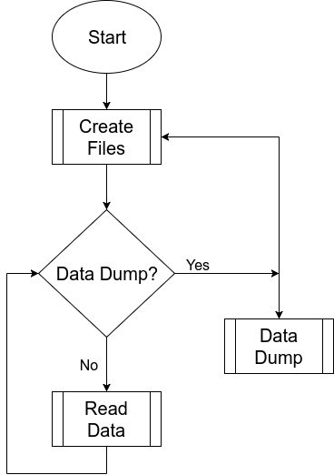

# Data Acquisition Platform

A data acquisition platform designed for the Raspberry Pi and Adafruit ADS1115 to record data to an InfluxDB server for the Eastern Nazarene College Earthquake Forecasting Platform

## Overview ##

In recent years, Eastern Nazarene College has been doing research into Earthquake Forecasting. The theory asserts that in the time leading up to an earthquake (months, days, hours, etc), several measureable physical changes occur. These changes span across disciplines and have varying degrees of evidence, but are refered to collectively as precursors. It is theorized that earthquakes can be forecasted by measuring and analyzing these precursors.

In order to meausure these precursors, a method is required to collect data along fault lines related to these precursors for later analysis. This system is a data acquisition platform designed to do this at a low cost.

## Hardware Architecture and Setup ##

The system is designed and tested for the popular Raspberry Pi microcomputer, although it should theoretically work on any system that supports Python 3.x and the I2C communication protocol.

Analog data from the precursor sensors is read and digitally converted using the Adafruit ADS1115 analog to digital converter. It is connected to the Raspberry Pi through the GPIO pins in I2C configuration. To wire the ADC to the Pi in I2C, connect: 

* ADS1x15 VDD to Raspberry Pi 3.3V
* ADS1x15 GND to Raspberry Pi GND
* ADS1x15 SCL to Raspberry Pi SCL
* ADS1x15 SDA to Raspberry Pi SDA

Each of the precursor sensors can then be wired to the ADC as Load Cells on A0-3. Each ADC unit can support up to four sensors, and the Pi can support up to 4 ADC units on individual I2C addresses (currently untested). See the [Adafruit Documentation](https://learn.adafruit.com/raspberry-pi-analog-to-digital-converters/ads1015-slash-ads1115) for more detailed instructions.



## Software Architecture ##

The system is designed using a data dump methodology. The system reads data from the ADC at specified intervals, and this data is recorded in local files until ready for the next data dump. Then a separate thread is invoked to upload to the locally recorded data to an InfluxDB server while still continuing to record data to new local files. The data is uploaded using REST requests against the Influx line protocol.



## Software Setup ##
### Microcomputer Environment Setup ###
The system is tested on a standard Raspberry Pi 3 microcomputer running Raspbian Linux. The Linux software requirements are 

* Debian Build Essential
* Python 3.x 
* Python Dev
* Python SMBus
* Pip

The python dependancies are as listed in `requirements.txt`. To setup the environment on Raspbian:

```bash
$ cd ~
$ sudo apt-get update
$ sudo apt-get install python3 python3-pip build-essential python-dev python-smbus git
$ git clone https://github.com/kbvatral/data-acquisition-platform.git
$ cd data-acquisition-platform
$ pip3 install -r requirements.txt
```
### Database Setup ###
The system is designed to record the measured data in a secured [InfluxDB database](https://www.influxdata.com/) on a server external to the platform. 

InfluxDB is a distributed RESTful nosql database designed to work with large volumes of time-series data. Please see the [Influx Documentation](https://docs.influxdata.com/influxdb/v1.5/) for instructions on installing and configuring a secured influx database on a server.

Once the database is installed and configured, edit the following lines in `influx_read.py` to match the server and authentication settings:

```python
# Influxdb Connection
host = '10.128.189.163'
port = 8086
ssl = True
user = 'root'
password = 'ENCLions'
dbname = 'mydb'
client = InfluxDBClient(host, port, user, password, dbname, ssl)
```

### Running The Software ###

The script is setup by default to read from each of the 4 pins of a connected ADC. Before running the script, modify the following lines in `influx_read.py` to match the required sample rates:
```python
# A list of intervals over which data is taken
intervals = []  # Internals (sec) before we get data again
intervals.append(1)  # Time (in sec) between each pin 0 measurement
intervals.append(2)  # Time (in sec) between each pin 1 measurement
intervals.append(1)  # Time (in sec) between each pin 2 measurement
intervals.append(4)  # Time (in sec) between each pin 3 measurement
intervals.append(10)  # Time (in sec) between each data dump
```

Also modify the following lines in `influx_read.py` to match the measurement names in the Influx database:
```python
# A list of influxdb measurements. The indecies of the list correspond to the
# pin number on the ADC
measurements = []
measurements.append('test_a0')  # Pin 0 measurement name
measurements.append('test_a1')  # Pin 1 measurement name
measurements.append('test_a2')  # Pin 2 measurement name
measurements.append('test_a3')  # Pin 3 measurement name
```

Also modify the following line in `influx_read.py` to match the reference voltage of the the ADC:
```python
# Choose a gain of 1 for reading voltages from 0 to 4.09V.
# Or pick a different gain to change the range of voltages that are read:
#  - 2/3 = +/-6.144V
#  -   1 = +/-4.096V
#  -   2 = +/-2.048V
#  -   4 = +/-1.024V
#  -   8 = +/-0.512V
#  -  16 = +/-0.256V
# See table 3 in the ADS1015/ADS1115 datasheet for more info on gain.
GAIN = 1
```

Once the hardware and software has been configured, run the script in a foreground process with:
```bash
$ cd src
$ python3 influx_read.py
```
